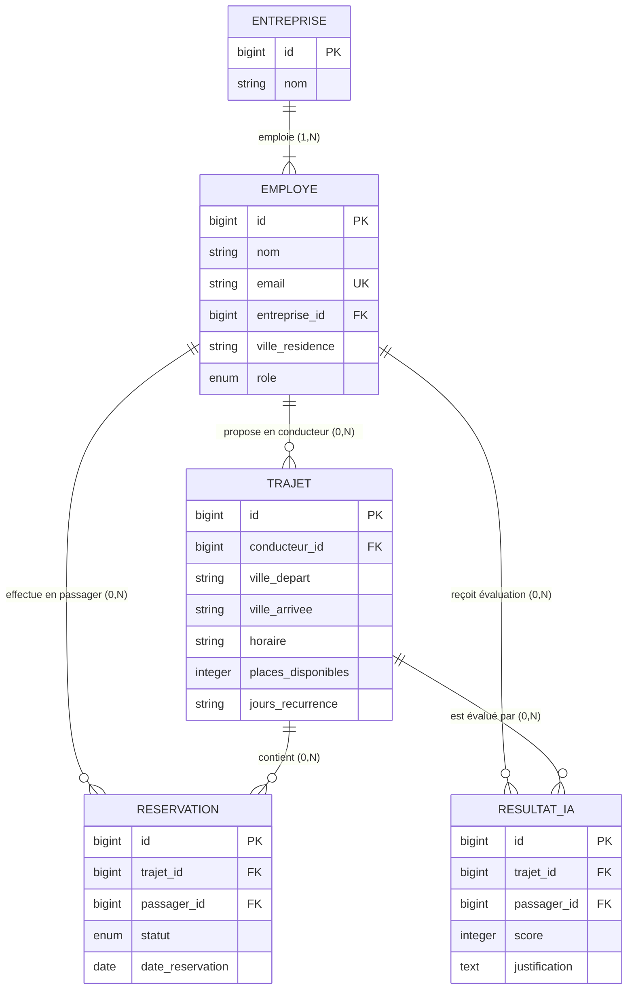

# CoRide - Conception de la Base de Données (MCD & MLD)

Ce document présente la modélisation conceptuelle et logique de la base de données de la plateforme **CoRide**, une application de covoiturage d'entreprise réservée aux salariés des entreprises partenaires.

---

## 1. Modèle Conceptuel des Données (MCD)

### Entités et Attributs
1. **ENTREPRISE**
   - `id` (PK, Entier, Auto-incrément)
   - `nom` (Chaîne, Unique)
   - `created_at`, `updated_at`

2. **EMPLOYE**
   - `id` (PK, Entier, Auto-incrément)
   - `nom` (Chaîne)
   - `email` (Chaîne, Unique, Email professionnel)
   - `entreprise_id` (FK vers ENTREPRISE)
   - `ville_residence` (Chaîne)
   - `role` (Enum: 'conducteur', 'passager', 'les deux')
   - `password` (Chaîne hachée)
   - `created_at`, `updated_at`

3. **TRAJET**
   - `id` (PK, Entier, Auto-incrément)
   - `conducteur_id` (FK vers EMPLOYE)
   - `ville_depart` (Chaîne)
   - `ville_arrivee` (Chaîne)
   - `horaire` (Chaîne)
   - `places_disponibles` (Entier)
   - `jours_recurrence` (Chaîne)
   - `created_at`, `updated_at`

4. **RESERVATION**
   - `id` (PK, Entier, Auto-incrément)
   - `trajet_id` (FK vers TRAJET)
   - `passager_id` (FK vers EMPLOYE)
   - `statut` (Enum: 'en_attente', 'confirmee', 'refusee', 'annulee')
   - `date_reservation` (Date)
   - `created_at`, `updated_at`

5. **RESULTAT_IA**
   - `id` (PK, Entier, Auto-incrément)
   - `trajet_id` (FK vers TRAJET)
   - `passager_id` (FK vers EMPLOYE)
   - `score` (Entier: 0 à 100)
   - `justification` (Texte)
   - `created_at`, `updated_at`

---

### Schéma Entité-Association (Mermaid)

---

## 2. Modèle Logique des Données (MLD)

1. **entreprises** (<u>id</u>, nom, created_at, updated_at)
2. **employes** (<u>id</u>, nom, email, #entreprise_id, ville_residence, role, password, created_at, updated_at)
3. **trajets** (<u>id</u>, #conducteur_id, ville_depart, ville_arrivee, horaire, places_disponibles, jours_recurrence, created_at, updated_at)
4. **reservations** (<u>id</u>, #trajet_id, #passager_id, statut, date_reservation, created_at, updated_at)
5. **resultat_i_a_s** (<u>id</u>, #trajet_id, #passager_id, score, justification, created_at, updated_at)

---

## 3. Contraintes d'Intégrité Référentielle et Règles Métier (Triggers / App Layer)

- **FK constraint**: `entreprise_id` ON DELETE CASCADE
- **FK constraint**: `conducteur_id` ON DELETE CASCADE
- **FK constraint**: `trajet_id`, `passager_id` ON DELETE CASCADE
- **Règle d'unicité de réservation**: `UNIQUE(trajet_id, passager_id)` pour les statuts actifs.
- **Contrainte de suppression**: Impossible de supprimer un `trajet` avec au moins une `reservation` de statut `'confirmee'`.
- **Contrainte de capacité**: Le nombre de réservations confirmées pour un trajet ne peut jamais dépasser `places_disponibles`.
